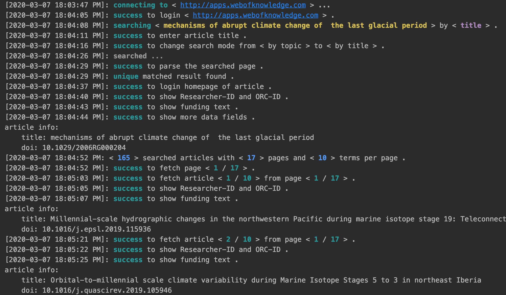

# A web crawler for academic resources

## TODO

* 


## Installation

```shell script
pip install tortoises
```

## Features


### web of science

**usage**

* step 1

```shell script
# install google chrome
wget https://dl.google.com/linux/direct/google-chrome-stable_current_amd64.deb
sudo dpkg -i google-chrome-stable_current_amd64.deb
sudo apt install -f -y --fix-missing
sudo apt-get -f install -y

/usr/bin/google-chrome-stable --version

# install google chrome driver
wget https://npm.taobao.org/mirrors/chromedriver/80.0.3987.106/chromedriver_linux64.zip
unzip chromedriver_linux64.zip
sudo mv chromedriver /usr/bin/

chromedriver --version
```
* step 2

```python
from tortoises.scholar.wos import AppWebKnowledge, AppWebKnowledgeParser

apk = AppWebKnowledge(headless=True, verbose=True)

# title = 'The ERA-Interim reanalysis: configuration and performance of the data assimilation system'
title = 'mechanisms of abrupt climate change of  the last glacial period'
apk.fetch_article(argument=title, mode='title')
apk.expand_all_fields()
parser = AppWebKnowledgeParser(verbose=False).parse_article(apk.driver)
print(f"article info:\n\ttitle: {title}\n\tdoi: {parser.parsed_info.get('doi')}")

apk.fetch_citation(_type='citing')

while True:
    for idx in range(apk.num_items_current_page):
        apk.fetch_current_page(index=idx)
        apk.expand_all_fields()
        parser = AppWebKnowledgeParser(verbose=False).parse_article(apk.driver)
        print(f"article info:\n"
              f"\ttitle: {apk.driver.find_element_by_class_name('title').text}\n"
              f"\tdoi: {parser.parsed_info.get('doi')}")
        apk.switch_handle()
    apk.next_page()
```



### pdf bulk downloader

### scholar 
